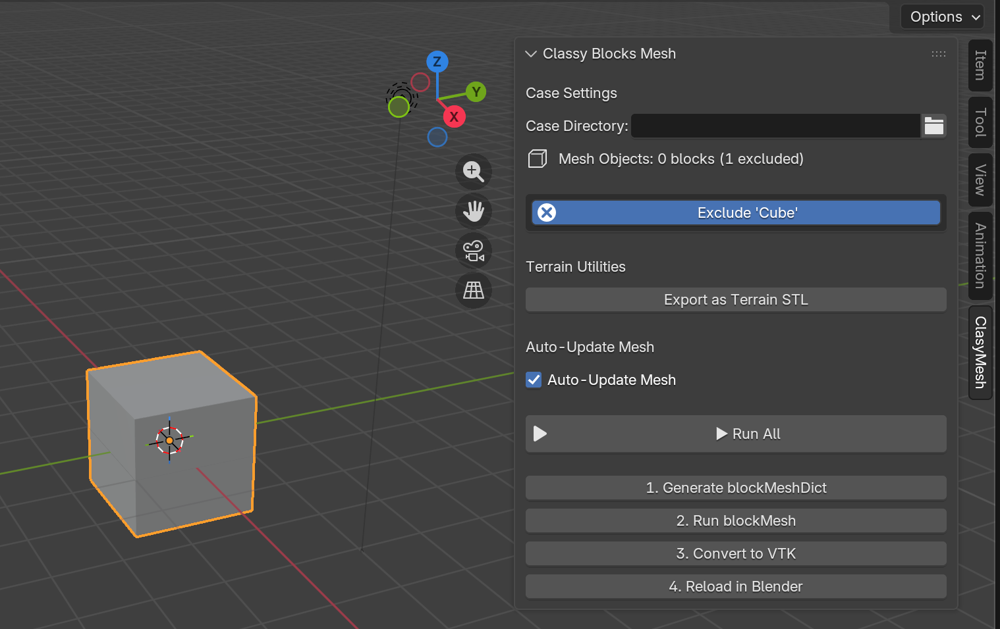
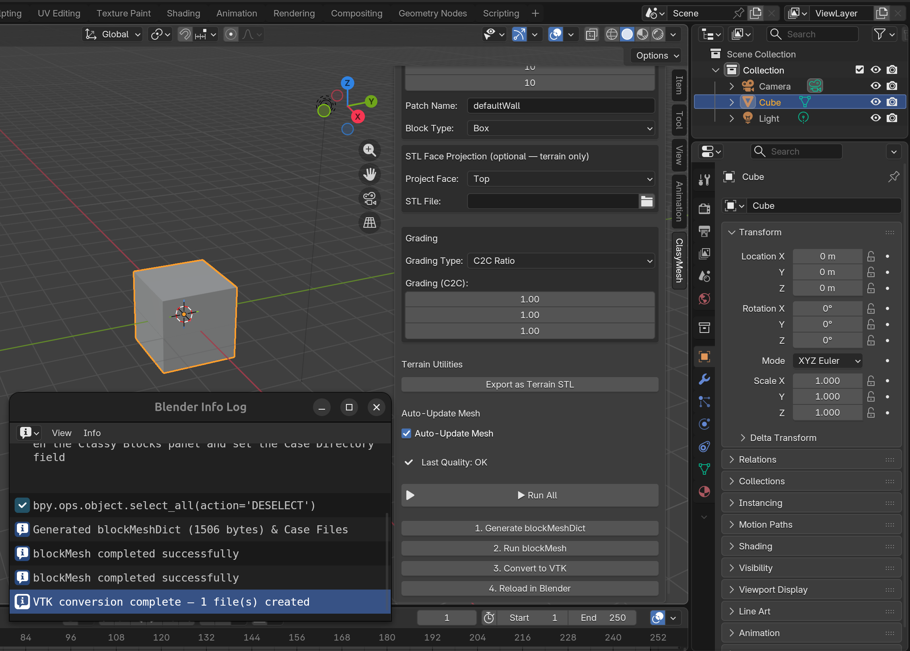
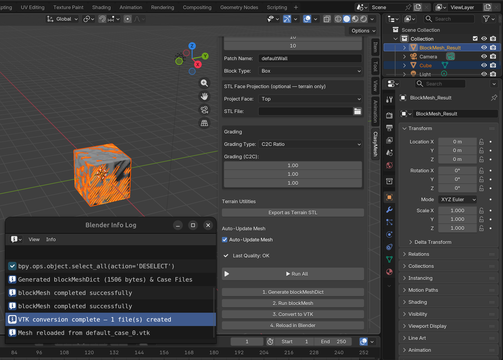

  
  <h1>Classy Blender Mesh</h1>
  
Seamlessly bridging Blender's intuitive 3D modeling with OpenFOAM's structured hex-meshing.

---

  <video src="video.mp4" controls width="800">
    Your browser does not support the video tag.
  </video>
   
  <em>Video demonstration of the workflow (coming soon).</em>

---

## Exact Problem Statement

The goal of this project is the **Classy Blocks Integration (Structured Mesh)**:
* Replace traditional, manual `blockMesh` dictionary writing with `classy_blocks` (an open-source Python API).
* Use a Blender frontend to intuitively create geometry (points, lines, sketches, extrusion, rotation).
* Rely on a backend where `classy_blocks` programmatically generates the `blockMeshDict`.
* Introduce advanced features such as terrain mapping, STL projection, and a CAD-like interface directly within Blender.
* Streamline the workflow: Create a cube (or other shape) -> run `blockMesh` -> convert to VTK -> reload the resulting mesh in Blender for validation.

## Future Implementation

* To include a GUI-controlled run-time OpenFOAM path configuration directly through Blender.

## Roadblocks Faced While Using `classy_blocks`

The primary roadblock encountered involves the strict topological requirements of the library. `classy_blocks` works exclusively for structured meshing. Consequently, taking a basic shape and arbitrarily modifying its geometry (e.g., pulling a single vertex out of planar alignment, or creating arbitrary internal holes) breaks the underlying hexahedral logic unless the modification strictly adheres to a shape supported by the `classy_blocks` API. 

Before determining that a specific geometric configuration is a definitive roadblock, always refer to the `classy_blocks_API_REFERENCE.md` documentation to check if a specific API construct (like a `Loft`, `Extrude`, or `Frustum`) supports the desired topology.

## Structured vs. Unstructured Meshes

Understanding the distinction between structured and unstructured meshes is critical when working with this add-on.

### Structured Meshes
A structured mesh is characterized by regular connectivity. The elements are topologically equivalent to a regular grid, meaning each interior vertex is surrounded by the exact same number of cells. 

**Examples:**
* A simple rectangular channel (Box).
* A straight pipe or cylinder divided into a core and radial boundary layers.
* A swept aerodynamic profile without complex intersections.
* A spherical domain built using multiple structured patches (e.g., a cubed sphere).

**classy_blocks compatibility:** `classy_blocks` is explicitly designed to handle these types of meshes. It excels at generating high-quality structured hexahedral blocks for these scenarios.

### Unstructured Meshes
An unstructured mesh has irregular connectivity. Elements (often tetrahedra, polyhedra, or mixed elements) can be placed arbitrarily to fill complex volumes without conforming to a rigid grid topology.

**Examples:**
* A complex engine block with intersecting cooling channels, chamfers, and fillets.
* Highly organic geometry like a scanned human heart or a sculpted creature.
* Complex architectural domains with varied, non-aligned buildings.

**classy_blocks compatibility:** `classy_blocks` **cannot** handle unstructured meshes. It cannot generate tetrahedra or polyhedra. If you require unstructured meshing for complex CAD assemblies, tools like OpenFOAM's `snappyHexMesh` or `cfMesh` are necessary instead.

## Usage of Dependencies

This project relies on a carefully orchestrated stack of Python libraries:

* **`classy_blocks`**: The core meshing engine on the backend. It abstracts the complex text-based formatting of OpenFOAM's `blockMeshDict` into a robust, object-oriented Python API, allowing programmatic definition of vertices, edges, faces, and blocks.
* **`bpy` (Blender Python API)**: Powers the frontend interface. It is used to draw the custom UI panels within Blender, extract geometric data (vertices, bounding boxes, matrices) from user-created objects, and manage the scene state.
* **`pyvista`**: Serves as a crucial validation and visualization layer. It is used in the pipeline to validate mesh integrity (e.g., checking for manifold topology and correct aspect ratios) before committing to OpenFOAM generation. It is also instrumental in loading the generated VTK files back into Blender for the user to inspect.

## Features & Interface

The add-on integrates smoothly into the Blender sidebar, providing immediate feedback and tools tailored for OpenFOAM preparation.

*Figure 1: The main interface panel providing meshing options and generation triggers.*

*Figure 2: Visualizing the transformation from a Blender mesh to a structured block.*

*Figure 3: The final structured mesh reloaded into Blender for visual confirmation.*
